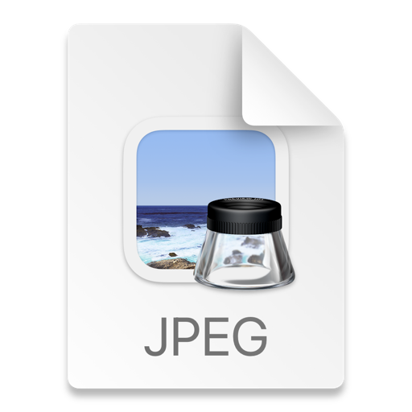

这篇博客记录了一次本人带猫从国内飞美国的记录。以此记录一下我的猫猫咪咪来美国的经历，以及给朋友们提供教程。
本篇博客分成准备篇和出行篇。准备篇主要讲述准备上飞机前如何准备，出行篇主要讲述安检、上飞机的流程等。

# 准备篇

## 准备篇-疫苗

国际航班带猫对猫本身疾病的疫苗，比如妙三多等，没有任何要求，主要要求在于狂犬疫苗。
博主选择的是达美航空，不同航司的要求大同小异，但是基本都要求的是一年以内，一个月以上的狂犬疫苗（一针即可）。
博主准备了四样疫苗相关的东西，最后只用上疫苗本：
- 疫苗本（必查）：这个必查
- ISO芯片（必查）：这个必查。ISO芯片大家可以理解为猫的身份证号，打上去后会在你的疫苗本上写上对应的编号。然后海关人员可以用一个仪器扫描你的猫的ISO芯片（一般打在后颈），和你的疫苗本上的编号进行交叉核对。
- 动物免疫证明（可选）：兽医院的医生给博主的猫开了一个狂犬疫苗证明（每个疫苗会对应一个），但没有用上。这个只有国内旅行会用，国际旅行用不上这个。
- 抗体证明（可选）：博主为了保险，还去让医生做了个抗体证明，但是最后也没用上。
- 海关的动物卫生证书（可选）：博主为了保险，还跑到万州海关去开了海关的证明，一会儿会具体讨论。但是最后也没用上。

## 准备篇-动物卫生证书（可选）

当时博主在小红书看到很多朋友会去海关开个动物卫生证书，博主以为这是必要的，所以也去开的，废了不少时间，但是最后没用上（绷）。不过博主考虑到有些朋友可能为了保险也会去开，因此博主说一下自己的流程：

首先，什么是动物卫生证书？动物卫生证书是为了满足出国的人员带动物的需求，由各地海关检疫人员检疫并出具的证书。
但是由于各国政府对于不同动物入境的需求不一样，因此部分情况下，这个动物卫生证书就不是必需的，比如**美国对于猫入境就是不需要这个的，但是对狗是需要的**。
这里博主说一下自己的经历：

1. 联系海关：
   - 这里大家需要注意一下，需要在自己的居住地所在海关办理出境。
   - 这里建议大家先12306咨询下自己所在地的对应海关是哪个，避免跑冤枉路😂。
   - 博主最后是绕了一大圈路，最后才联系上海关，途中打了N个电话，所以建议大家早点办理（如果需要的话）
   - 博主最后加上海关工作人员的微信，协调办理时间（这个很特殊，主要因为博主去的海关没什么人来办理这个业务，所以能加上热心的海关工作人员的微信）
   - 注意：《动物卫生证书》有效期一般是14天，预估好办理时间
   - 在去海关之前，大家记得必须要在海关预约下：https://mp.weixin.qq.com/s/2iq3Gif24gIIe5b1K4TiMg （可以参考下这个预约流程）
   - 因为可能遇到排队，所以这里博主建议大家早点预约
   - 博主能迅速预约到是因为去的海关没啥人办这个业务，所以加了海关工作人员微信后当场预约然后第二天就通过了🤣
2. 准备材料：
   - 疫苗本和ISO芯片：这里和上一篇相同，大家记得去海关办理时候带上疫苗本和ISO芯片。
   - 主人护照、身份证等：这些是基础材料，大家记得带上，海关方面会复印你的护照+身份证留档。
   - 血清检测报告（注射完狂犬疫苗1个月后）：这个不是完全必须的，博主发现小红书上不同的经历对这个血清检测报告要求不同，有的可以自己找医院做，有的会海关工作人员当场做。博主还是建议大家做了，避免麻烦。
   - 出行飞机预定截图：海关还会要求你的出行飞机预定截图，博主是携程买的，最后在携程截了个屏就行了。**这个记得带一个打印件**
3. 海关办理：
   - 博主在预约的时间一路坐车去了海关，下面是博主的经历：
   - 接待博主的海关工作人员表示这是2025年他们第一次遇到带宠物出行的，然后把博主引进一个检疫房间
   - 检疫房间有两个穿检疫服的工作人员，和刚拆封的ISO芯片扫描器（对的，刚拆封，他们确实是第一次碰到来这里检疫的🤣）
   - 检疫人员对猫猫的状态进行了查看，然后验证了下博主的疫苗本上对应的芯片编码
   - 期间，海关各种工作人员，包括很多小姐姐小哥哥都来这个房间看猫🤣
   - 最后接待博主的海关人员带着博主去复印文件和准备动物卫生证书
   - 这里需要注意的是，虽然博主当天当场就拿到动物卫生证书，但是不同海关不一样。比如上海等海关可能需要当场血清检测，并且动物卫生证书可能过三天才能拿到

## 准备篇-机票

博主在准备期间，同时对机票进行了查询。

首先，大部分国内航司都不允许带猫上飞机，只有韩亚、达美、美联航等外国航司允许带猫上飞机。其中：

- 韩亚因为需要首尔转机，直接被博主pass了。
- 美联航因为每个乘客只能带一只猫，而博主有两只，如果要带多的猫，要么有个人一起，要么多买一张机票
- 达美允许一个乘客带两只猫

因此博主最后选择了达美航空。这里还需要注意的是，达美航空对两只猫一起的要求是必须六个月以下或者母子/母女（为了小猫的哺乳需求），因此大家如果要带两只猫，请注意猫猫的月份哦。
同时，订宠物位子需要在飞机起飞前30天-2天之内，博主建议大家起飞前30天马上预定，不然容易被抢光位子。

同时，这里理一下博主订机票的流程：

- 首先，博主查询了下当时从上海出发的达美的航班号。
- 然后，博主拨打了达美的电话号码 400 120 2364，注意因为达美的电话服务很繁忙，因此博主建议大家最好在每天早上达美工作时间最开始（我记得是七点，大家可以自己查询下有无更新）打电话，不然你打不通。
- 你也可以在达美的app上跟客服聊，不过博主当时英语一般，就算了🤣
- 博主询问了客服对应的航班号有没有宠物位子，在得知有宠物位子后：
  - 博主首先去携程订了达美的机票
  - 然后博主打了第二个电话，跟客服说明需要带两只布偶猫
  - 客服还需要确定，大家记得提前准备后，猫包尺寸记得上网查一下，博主也记不得了😑：
    - 猫的月份
    - 猫的体重
    - 猫包尺寸
  - 客服确定后，给我预定了猫的位子，两只猫一起和一只猫的价格都是200美元，到时候在机场付款
  - 博主提醒下大家，定好位子后，记得可以在起飞前15天等时间再打电话确认下。因为博主之前看过小红书上猫的位子被挤占的案例。

# 出行篇

## 出行篇-酒店

博主是从上海出发的，但是博主家不是上海的，因此住了一天酒店。
博主建议出行前找好宠物友好的酒店，因为很多酒店不一定允许宠物入住。
同时酒店也会检查宠物的疫苗本，所以建议大家也携带在身上，方便检查。

## 出行篇-出发前准备

- 博主是两只猫一起走，不过比较熟悉比较好。大家如果带两只互相不太熟的猫，记得把他们关一起关一周熟悉下彼此，因此达美航空对两只猫的要求是能够和平相处。
- 博主建议大家带一下防应激喷雾和猫条，在飞机上安抚猫猫。

## 出行篇-机场安检

到机场后，在机场check in的时候，航司会对猫进行检查，下面是流程：

- 航司人员会确定你有猫后把你单独领到一边
- 航司人员会对你的猫的状态（是否生病）、猫的数量和品种、猫的疫苗本进行检查
- 检查完毕后，航司人员会对你收取对应的费用（200美元），这里笔者建议大家带个国内银行卡，当时笔者只带了准备来美国用的国际卡，结果用不了，最后用人民币现金支付的😂
- 然后航司人员就会在你的猫包上捆一个标记，在安检人员那里验证。
- 过安检的时候，因为怕猫猫进安检机器受惊，因此安检人员把博主领到了海关的办公室，把猫猫们放出来后把其他东西包括猫包拿去单独安检了。
- 过安检后，就可以去候机室了

## 出行篇-航班上

上飞机后，工作人员会要求你把猫放到座椅下面，你的脚前面。经济舱这么放其实很不舒服，博主因为人高马大，所以一直没法睡觉😑。
途中记得给猫猫喂点猫条和水，不然猫很容易得肠胃炎。

## 出行篇-到达后

美国海关不会对猫猫进行任何检查，大家到家后记得安抚下猫猫情绪就可以啦！